> # 反射机制与游戏场景
> 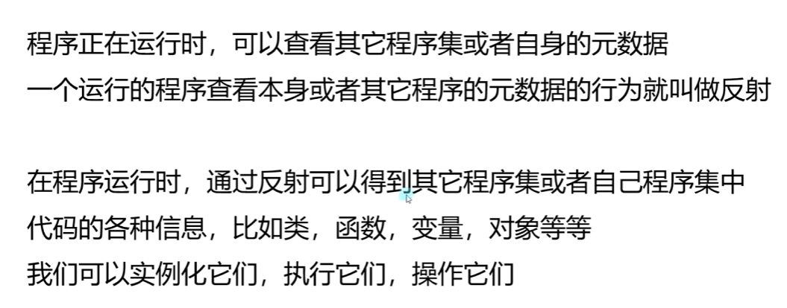 
> 1. 反射机制: 
>   由.NET框架提供，可以在程序运行时获取类信息，创建对象实例，调用方法
> 2. 反射机制的体现: 
> 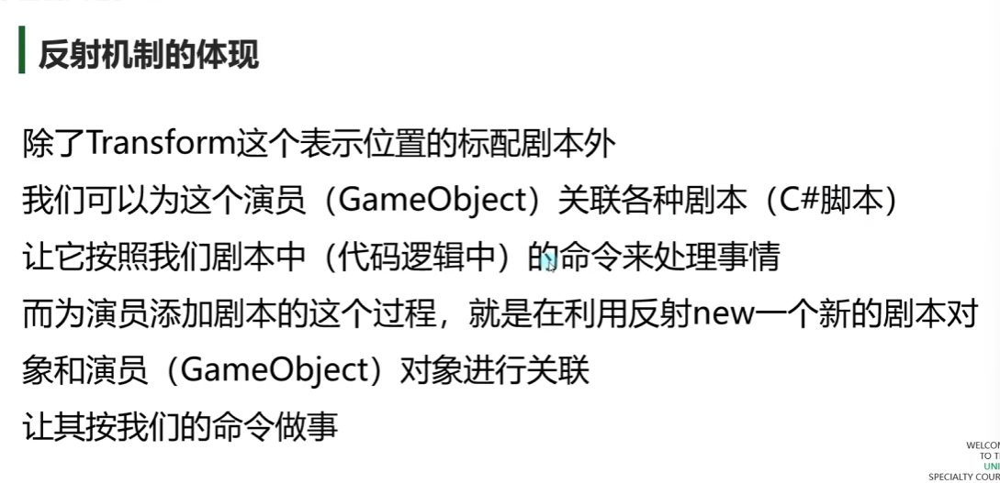 

# 获取脚本挂载的物体的数据
---
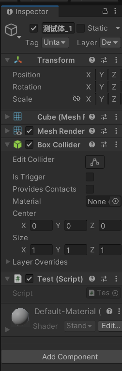 
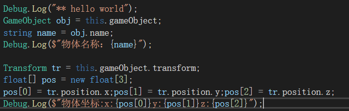 
>通过创建对象调用,一般来说，物体GameObject为最上层对象，若要获取物体的坐标等数据的对象需通过GameObject.Transform之类的方式获取（通常会加上一个this.  从而方便的获取挂载物体）
---
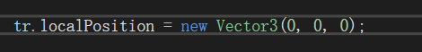 
>改变物体的位置(localposition为相对坐标 postiton为绝对坐标) 
>小数需要在坐标末尾添加一个f(new vector(1.5f,1.5f,1.5f))
---
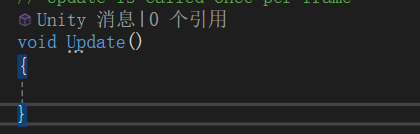 
>update方法 每帧调用
>start方法仅在开始三调用一次
---
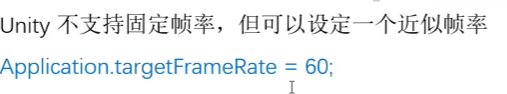
>规定帧率（使un尽量为该帧率）
---
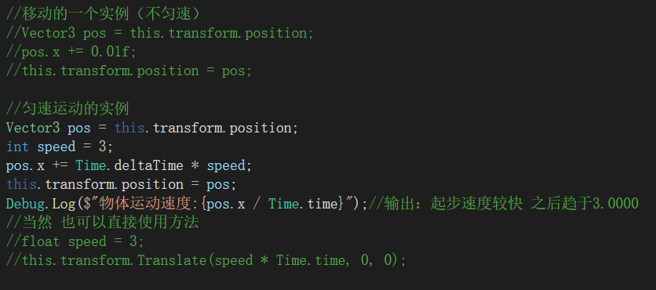
>物体移动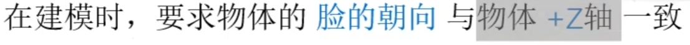（模型规范）
---
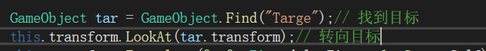
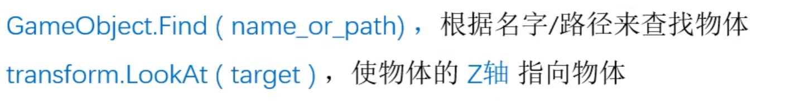
>面向其他模型移动
>lookat 是将物体z轴面向目标物体
---
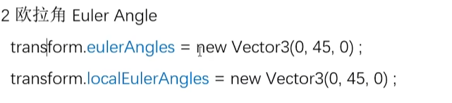
>通过欧拉角来旋转物体
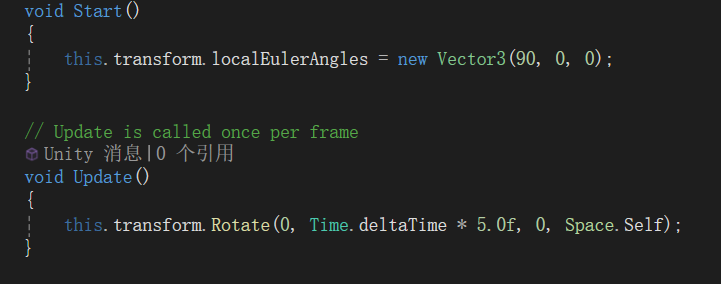 
>通过方法直接旋转

---
# monobehaviour
>1.所有的脚本均继承这一个对象 
>2.常用的消息函数 
>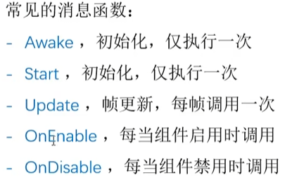 
>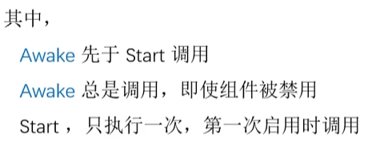 
>3.执行顺序 
>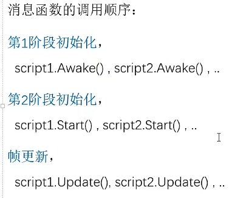
---
# 主控脚本
>1.存放游戏基本逻辑代码 
>2.创建空节点挂载主控
---
# 脚本参数
>1.添加能手动操作的参数 
>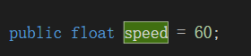 
>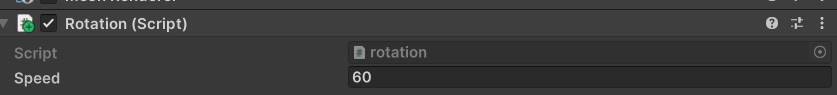 
>2.更多用法 
>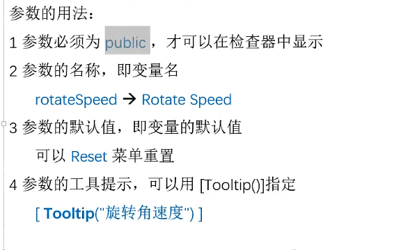
---
# 输入
>1.键盘输入 
>   Input.GetKey(KeyCode)   当keycode按住时返回true 
>   Input.GetKeyDown(KeyCode)   当keycode按下帧返回true 
>   Input.GetKeyUp(keycode)     当keycode抬起帧返回true 
>常用键位:
>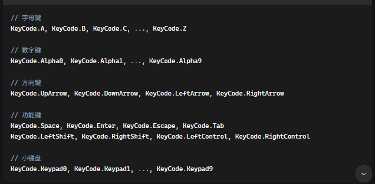 
>2.鼠标输入 
>   Input.GetMouseButton(mousekey)  当鼠标按下返回true 
>   Input.GetMouseButtonDown(mousekey)  当鼠标按下执行 
>   Input.GetMouseButtonUp(mousekey)    当鼠标抬起执行 
>mousekey:| 0:左键 | 1:右键 | 2:中键 |
>3.获取鼠标的百分比坐标 
>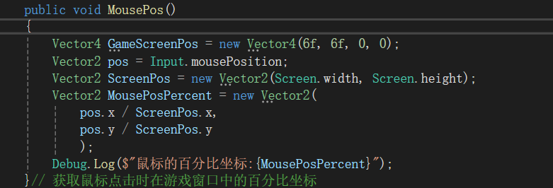 
>4.获取鼠标对于世界坐标系的位置 
>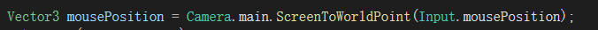
---
# 另一种获取目标组件的方法
> 组件类型 变量名称 = this.GetComponent<>(组件名称); 
>注：若存在多个同名组件，可以通过数组方式创建一个包含多个组件的数组变量 并且使用GetCompnents
>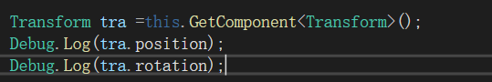 

# 调用其他物体组件
> 先用public GameObject定义一个变量 
> 先通过GameObject.find()找到目标物体 
> 获取父级 
>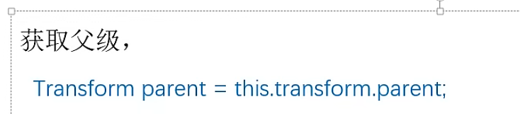 
> 获取子级 
> 1.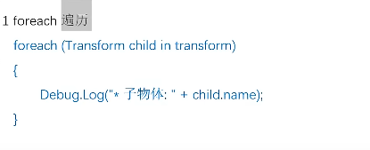 
> 2.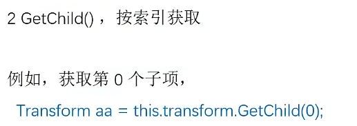 
> 3.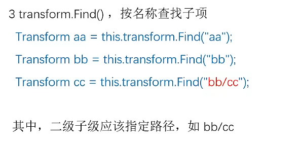 
> 注意：父子级是挂载在transform上面的

# 物体的操作
> 1.设置新的父级 
>   ("/xxx")表示从根开始寻找
> 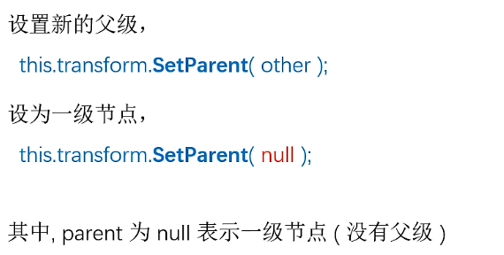 
> 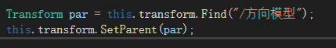 
> 2.显示/隐藏物体 
>   gameObject.setActive(true/false)调整物体的显示/隐藏 
>   (注意：该方法来自于gameObject) 
> 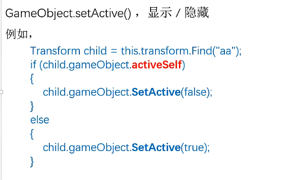 

# 定时器
> 定时器直接在start中挂载，start自动运行定时器线程 
> 如果添加了两个相同的调度，两个调度独立执行 
> 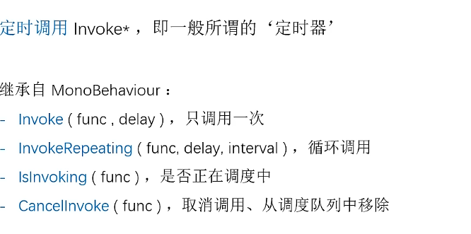 
> 用isInvoking(func) 检测是否有调用
》 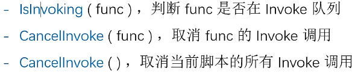 
> 注:unity是单线程的 不考虑线程并发，互斥 
> 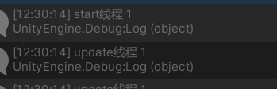
# 向量
> **以vector3为例子** 
> 向量长度 vector3.magnitude; 返回向量的长度 
> 将向量化为单位向量 vector3.normalized; 减少各个分量，使向量长度为1 
> **向量可直接相加** 
> ### 向量乘法 
>   标量乘法 b=a*2 
>   **点积 c=vector3.Dot(a,b);** 
>   $~~~~$可以用于判断两个向量在方向上的相似程度 
>   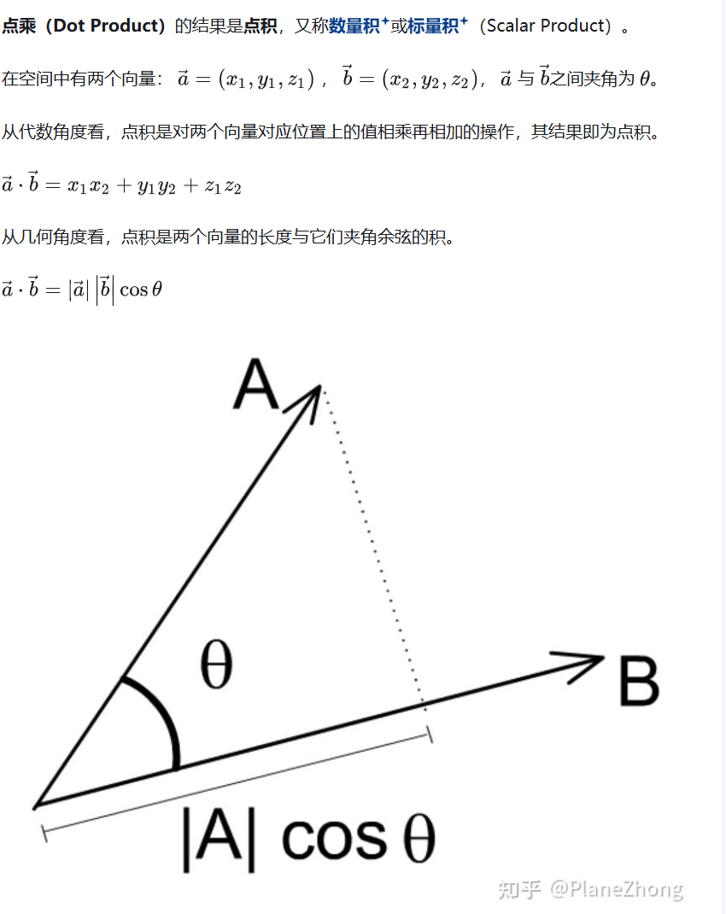 
>   **叉积 c=vector3.Cross(a,b);** 
>   $~~~~$求a，b向量的法向量 
>   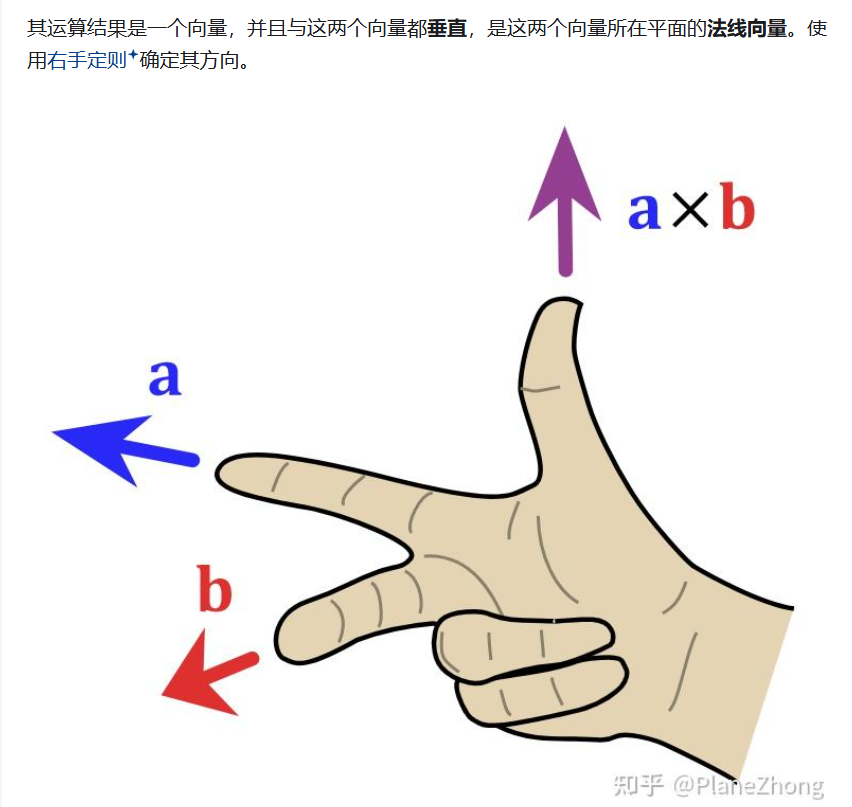 
>   $~~~~$也可以求两个向量围成平行四边形的面积 
>   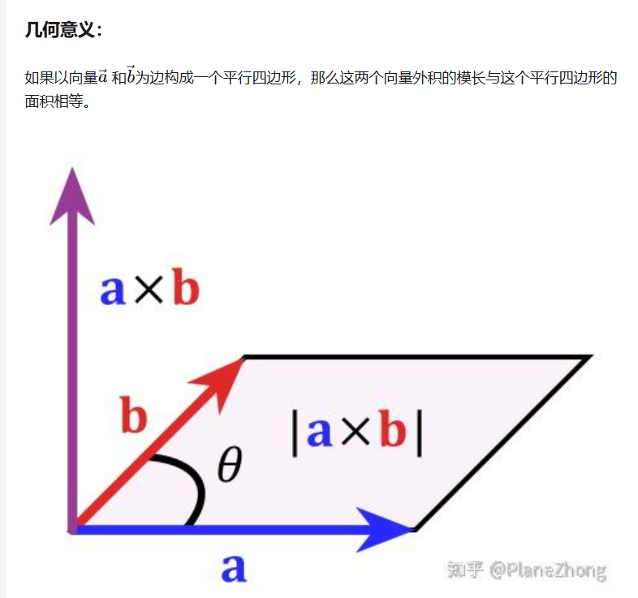 
>
> ### 已经定义好的常量 
> 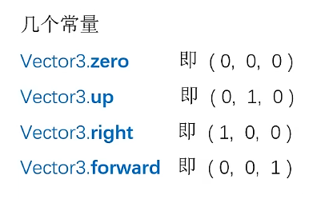

---
# unity预制体
> 创建Prefabs文件，将挂载好的物体拖入，会**自动**生成预制体文件 
> 预制体与原件的关系 
> 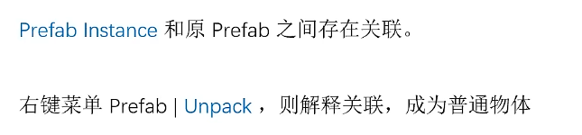 
> 创建好预制体后，原始物体可以删除 
> 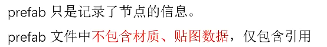  

# 动态创建实例
> 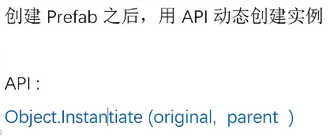
> ### 实例的初始化
> 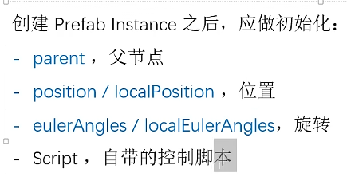 
> 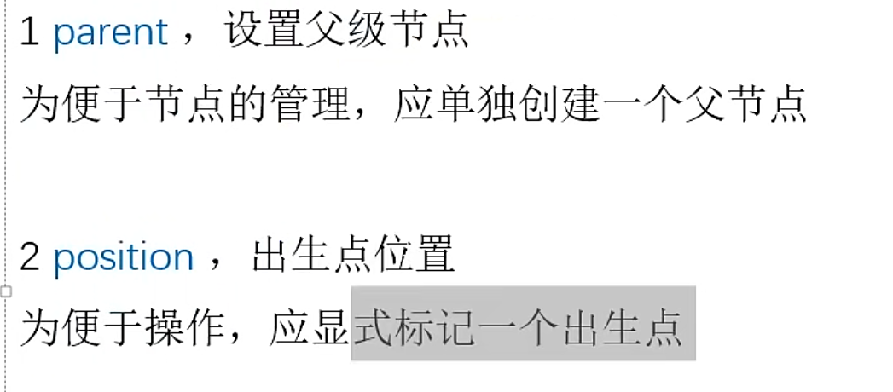 
> 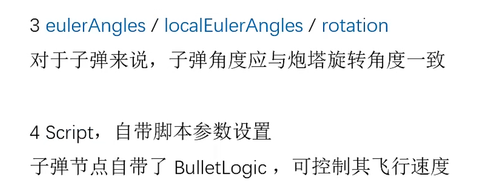 
> 注:对于在脚本中已经创建好的public类,可以初始化时直接修改 
>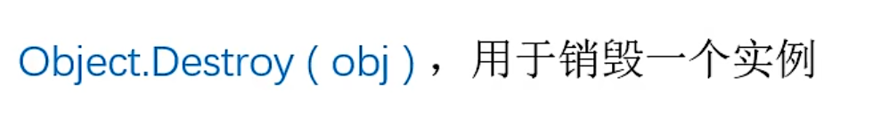

># 为游戏添加物理系统
> 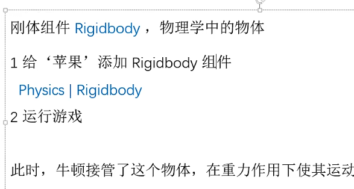 
> mess 质量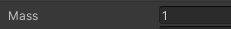 
> 1. 碰撞体组件 
>   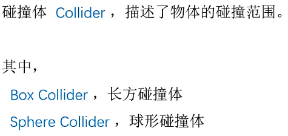 
>   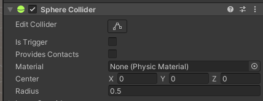 
>   edit 编辑物体的碰撞体积
> 2. 反弹与摩擦 
>   动态摩擦/静态摩擦: 
>   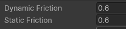 
>   反弹系数: 
>   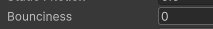 
> 3. 碰撞检测 
>   刚体的三种类型 
>   
>   1).为物体添加rigidbody 与 collider 
>   2).打开collider中的trigger 
>   3).重写void OnTriggerEnter2D(Collider2D collision)函数(对于2D碰撞)(该函数是un中的原生事件函数) 
>    
>   4).碰撞事件 
>    
>   注: 
>    
>   5).识别碰撞目标身份 
>    
>   添加tag 
>    

># Mathf
>   1.mathf.atan(y,x) 
>   

> # GUI
> 所有的UI都需要基于canvas画布 
>    
>   1.Image图片 
>        
>       sourceImage 导入的图片 
>       Color 基底颜色 一般为白色 
>       ImageType 图片显示方法  
>   2.  Text 文本  
>        
>   3. Button 按钮 
>       由button本体和一个text组成 
>        
>       normalColor  默认颜色
>       HightLightColor  鼠标触碰到时的颜色 
>       PressedColor 鼠标按下时的颜色 
>       SelectColor  鼠标抬起后的颜色 
>       onClick  当button点击时 执行其中的脚本文件 细分到脚本中的每一个方法(需要public修饰) 
>   3. Panel 平板
> 

> # 部分常用的鼠标方法(这里需要一直更新)
> 1. 按键检测 input.GetMouseButton/Down/Up(...) 
> 2. 双击检测(实际上就是检测两次点击之间的间隔 使用lastTime寄存上一次点击的时间) 
> 3. 获取坐标 
>   1) input.GetMousePosition() 获取鼠标坐标(基于屏幕坐标系) 
>   2) Camera.main.ScreenToViewportPoint( mouseScreenPos ) 转化为基于Viewport的坐标(0-1范围) 
>   3) Camera.main.ScreenToWorldPosition/2D( mouseScreenPos ) 转化为基于游戏世界坐标 
> 4. 光标锁定 
>   1) Cursor.lockState = CursorLockMode.Locked; 锁定到屏幕中心 
>   2) Cursor.lockState = CursorLockMode.None;   自由移动 
>   3) Cursor.lockState = CursorLockMode.Confined; 鼠标不能移出窗口 
> 5. 切换可见性 Cursor.visible = true/false;  

> 